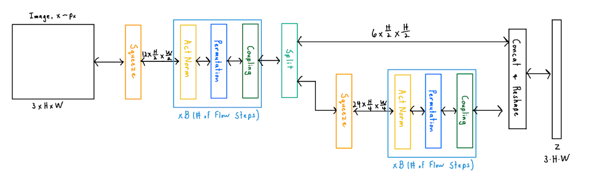

# normalizing_flow_basics

This repository contains code for a basic GLOW type normalizing flow. 
The code is capable for training for  MNIST, FashionMNIST, and CIFAR10 datasets.
The code is written with the [FrEIA](https://github.com/vislearn/FrEIA) to handle
the invertible architecture.
The GLOW 1x1 convolution is based on the implementation from [here](https://github.com/rosinality/glow-pytorch).


## Installation
You should be able to install all the dependencies with the following commands:
```
# Create a new conda environment if you want
conda create -n normalizing_flow python=3.9
conda activate normalizing_flow

# Install PyTorch
conda install pytorch torchvision pytorch-cuda=12.1 -c pytorch -c nvidia

#Install Pytorch Lightning
python -m pip install lightning

pip install -r requirements.txt
```


## Organization of the code
configs: 
- Contains the configuration files for the experiments.
- This file also contains the location of the data and where the save the model checkpoint.
- Change these files to change the hyperparameters of the experiments. (i.e. dataset, learning rate, number of layers, etc)

models:
- Contains all the code for the models.
- components:
  - Contains individual components of the model. (i.e. coupling layers, subnetworks, 1x1 convolutions, etc)
  - [building_blocks.py](models/components/building_blocks.py) contains the basic building blocks of the model
  predefined like downsampling/squeeze layers, flow steps (actnorm + invertible 1x1 + coupling). You can
  add different variations here if you want
- [network_builds.py](models/network_builds.py) contains the code for building the model architecture using 
the building blocks from [building_blocks.py](models/components/building_blocks.py)
- [flow.py](models/flow.py) contains all the code for the flow model in a PyTorch Lightning module. 
The forward pass, training, validation, and other functions are defined here.

datasets:
- Contains the code for the PyTorch Lightning dataset that will load the data and preprocess it.
- Currently it is implemented to work with MNIST, FashionMNIST, and CIFAR10 datasets.

utils.py:
- Contains some helpful functions for plotting images, reading configuration files, etc.

train.py:
- Contains the code for training the model. It will read the configuration file and train the model

eval_get_logpz_ldj.py:
- Code for testing out a model and getting the log prior and the log determinant of the Jacobian.
- This code will plot the NLL, log prior, and log determinant of the Jacobian for the test set.
- This also shows how you can extract the log prior and ldj for each layer separately.


## Working with the code
To modify the hyperparameters of the model, you can change the configuration files in the configs folder.

To train the model, you can run the following command:
```
python train.py
```
You'll be able to visualize the progress with Tensorboard. In a separate terminal, run
```angular2html
tensorboard --logdir=LOCATION_OF_LOGS --port PORT#
```

To test out the model and get the log prior and log determinant of the Jacobian, 
modify the code in [eval_get_logpz_ldj.py](eval_get_logpz_ldj.py) to specify the location of the model checkpoint and run the code
in the Python console

## Notes:
- A good reference for normalizing flows is [here](https://uvadlc-notebooks.readthedocs.io/en/latest/tutorial_notebooks/tutorial11/NF_image_modeling.html)
- Since the datasets are discrete, we used dequantization to make the data continuous. The implementation was based on
the [reference](https://uvadlc-notebooks.readthedocs.io/en/latest/tutorial_notebooks/tutorial11/NF_image_modeling.html)
- Since the model is made continuous, the nll must be adjusted to account for this. The explanation of this is not very clear
in the literature but this [thread](https://www.reddit.com/r/MachineLearning/comments/56m5o2/discussion_calculation_of_bitsdims/)
gives a decent explanation.
- The model configurations are not optimally tuned. They are a good starting point and match the BPD specified in 
[DO DEEP GENERATIVE MODELS KNOW WHAT THEY DON’T KNOW?](https://arxiv.org/pdf/1810.09136.pdf), but further tuning 
could give better performance.